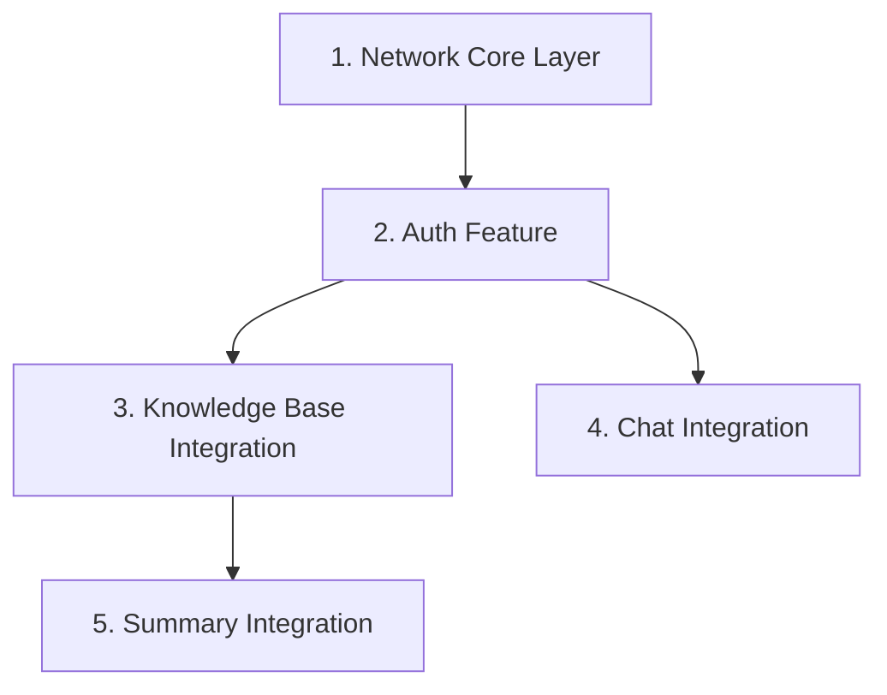

# Gnyaan — Backend Integration Plan

## Overview

Wire the existing Flutter UI (currently using hardcoded demo data) to the live Node.js/Express backend running on `localhost:3000`. The app uses **Dio** (already in pubspec) for networking and **SharedPreferences** (already in pubspec) for JWT persistence.

---

## Proposed Changes

### Component 1 — Network Core Layer

#### [NEW] `lib/core/network/api_client.dart`

A centralized Dio singleton that:
- Sets `baseUrl` to `http://10.0.2.2:3000/api` (Android emulator → host localhost)
- Registers an interceptor that reads the JWT from `SharedPreferences` and injects `Authorization: Bearer <token>` on every protected request.
- Provides typed helper methods: `get()`, `post()`, `postMultipart()`.

#### [NEW] `lib/core/network/api_endpoints.dart`

Static constants for every route so paths are never hardcoded in features:

| Constant | Value |
|---|---|
| `auth/register` | `POST /auth/register` |
| `auth/login` | `POST /auth/login` |
| `upload/ingestion` | `POST /upload/ingestion` |
| `upload/documents` | `GET /upload/` |
| `upload/summary` | `POST /upload/summary` |
| `chat` | `POST /chat/` |
| `chatHistory` | `GET /chat/` |

---

### Component 2 — Authentication Feature (NEW)

> [!IMPORTANT]
> There is currently **no auth feature** in the app. The onboarding screen navigates directly to `/home`. We need Login + Register screens that obtain and persist a JWT before any protected screen is accessible.

#### [NEW] `lib/features/auth/services/auth_service.dart`

**Register** — `POST /api/auth/register`
- Request body: `{ name, email, password }`
- Success response (201):
```json
{ "success": true, "_id": "...", "name": "...", "email": "...", "token": "jwt..." }
```
- Error responses: `400` (user exists), `500` (server error)

**Login** — `POST /api/auth/login`
- Request body: `{ email, password }`
- Success response (200): same shape as register
- Error: `401` (invalid credentials)

On success, persist `token` + `name` + `email` to `SharedPreferences`.

#### [NEW] `lib/features/auth/presentation/screens/login_screen.dart`

Premium dark-themed login screen matching the app's existing design system (AppColors, AppTextStyles). Email + Password fields, "Login" primary button, "Create Account" link to register.

#### [NEW] `lib/features/auth/presentation/screens/register_screen.dart`

Name + Email + Password + Confirm Password. Same design language. Navigates to `/home` (AppShell) on success.

#### [MODIFY] [main.dart](file:///c:/Hackathons/gnyaan/mobile/lib/main.dart)

- Add `/login` and `/register` routes.
- Change initial route logic: if JWT exists in SharedPreferences → `/home`, else → `/onboarding`.

#### [MODIFY] [onboarding_screen.dart](file:///c:/Hackathons/gnyaan/mobile/lib/features/onboarding/screens/onboarding_screen.dart#L217-L219)

- `_goToApp()` navigates to `/login` instead of `/home`.

---

### Component 3 — Knowledge Base Integration

#### [NEW] `lib/features/knowledge_base/services/document_service.dart`

**Upload** — `POST /api/upload/ingestion`
- Multipart form-data, key: `files`, attach PDF(s)
- Response: `{ success: true, message: "...", docsPending: N }`

**Fetch Documents** — `GET /api/upload/`
- Response:
```json
{
  "success": true,
  "documents": [
    {
      "_id": "...",
      "title": "System Architecture v3.pdf",
      "originalFileName": "...",
      "fileType": "application/pdf",
      "fileSize": 4200000,
      "status": "ACTIVE" | "PROCESSING" | "FAILED",
      "chunkCount": 186,
      "createdAt": "2026-04-17T...",
      "lastIndexedAt": "..."
    }
  ]
}
```

#### [MODIFY] [knowledge_hub_screen.dart](file:///c:/Hackathons/gnyaan/mobile/lib/features/knowledge_base/presentation/screens/knowledge_hub_screen.dart#L32-L82)

- Remove the hardcoded `_docs` list (lines 33-82).
- Make `DocModel` a proper mapping from the backend JSON (with `_id`, `title`, `fileSize`, `status`, `chunkCount`, `createdAt`).
- Call `GET /api/upload/` in `initState` to populate the list.
- Show `SkeletonLoaders` while loading.
- Map backend status (`ACTIVE` / `PROCESSING` / `FAILED`) to existing `DocStatus` enum.

#### [MODIFY] [upload_dropzone.dart](file:///c:/Hackathons/gnyaan/mobile/lib/features/knowledge_base/presentation/widgets/upload_dropzone.dart)

- Change `onUpload` callback signature to accept selected files.
- Use `file_picker` (already in pubspec) to pick PDFs.
- Call `POST /api/upload/ingestion` with multipart payload.
- After upload, trigger a refresh of the documents list.

---

### Component 4 — Chat Integration

#### [NEW] `lib/features/chat/services/chat_service.dart`

**Send Query** — `POST /api/chat/`
- Request body: `{ "query": "..." }`
- Response:
```json
{
  "answer": "Based on your documents...",
  "isFallback": false,
  "responseTimeMs": 1234,
  "sources": [{ "documentId": "...", "score": 0.94 }]
}
```

**Get History** — `GET /api/chat/`
- Response:
```json
{
  "success": true,
  "messages": [
    { "role": "user", "text": "...", "timestamp": "..." },
    { "role": "assistant", "text": "...", "timestamp": "...", "isFallback": false, "sources": [...] }
  ]
}
```

#### [MODIFY] [chat_screen.dart](file:///c:/Hackathons/gnyaan/mobile/lib/features/chat/presentation/screens/chat_screen.dart#L29-L68)

- Remove the hardcoded `_messages` list (lines 30-68).
- Call `GET /api/chat/` in `initState` to seed chat history. Map `messages[].role` / `messages[].text` to existing `ChatMessage` model.
- Replace the `_sendMessage()` method (lines 137-176): instead of `Future.delayed` simulation, call `POST /api/chat/` with the query, then append the real `answer` to the messages list.
- Map `sources` from the API response to the existing `ChatSource` model used in `MessageBubble`.

---

### Component 5 — Summary Integration

#### [NEW] `lib/features/summary/services/summary_service.dart`

**Generate Summary** — `POST /api/upload/summary`
- Request body: `{ "documentId": "..." }`
- Response:
```json
{
  "success": true,
  "cached": false,
  "summary": "...",
  "tldr": "...",
  "title": "System Architecture v3.pdf",
  "responseTimeMs": 2340
}
```

#### [MODIFY] [summary_screen.dart](file:///c:/Hackathons/gnyaan/mobile/lib/features/summary/presentation/screens/summary_screen.dart#L28-L92)

- Remove all hardcoded demo data (`_tldr`, `_concepts`, `_glossary`, `_insights` — lines 28-92).
- Accept a `documentId` parameter (passed when user taps a document card).
- Call `POST /api/upload/summary` on init to get `summary` and `tldr`.
- Populate the TLDR card and Summary tab from the response.
- The Concepts, Glossary, and Insights tabs can remain as static placeholders for now (the backend doesn't generate those yet), or we can parse them from the summary text.

---

## Execution Order



1. **Network Core** — everything depends on `ApiClient`
2. **Auth** — all protected routes need a token first
3. **Knowledge Base** — uploads + fetch doc list
4. **Chat** — query + history
5. **Summary** — needs a `documentId` from the knowledge base

---

## Open Questions

> [!WARNING]
> 1. **Summary tab data**: The backend returns `summary` (string) and `tldr` (string). Your current Concepts/Glossary/Insights tabs have structured data. Should I keep those tabs as static demo data, or remove them entirely, or try parsing concepts from the summary text?
> 2. **Riverpod**: I see `flutter_riverpod` in your dependencies but no providers created yet. Should I implement proper Riverpod StateNotifierProviders for auth/documents/chat state, or keep it simple with setState for the hackathon?

---

## Verification Plan

### Manual Testing
1. Start the backend: `node server.js` in the backend directory
2. Run the Flutter app on Android emulator
3. Test flow: Onboarding → Register → Login → Upload PDF → View in Knowledge Hub → Open Chat → Ask question → View Summary
